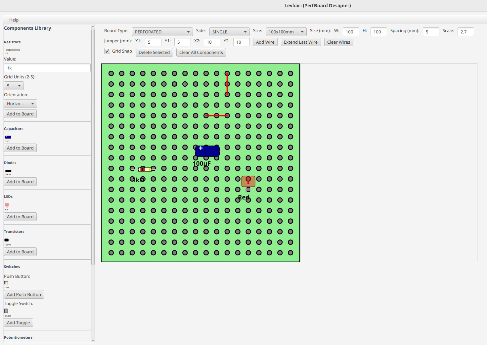
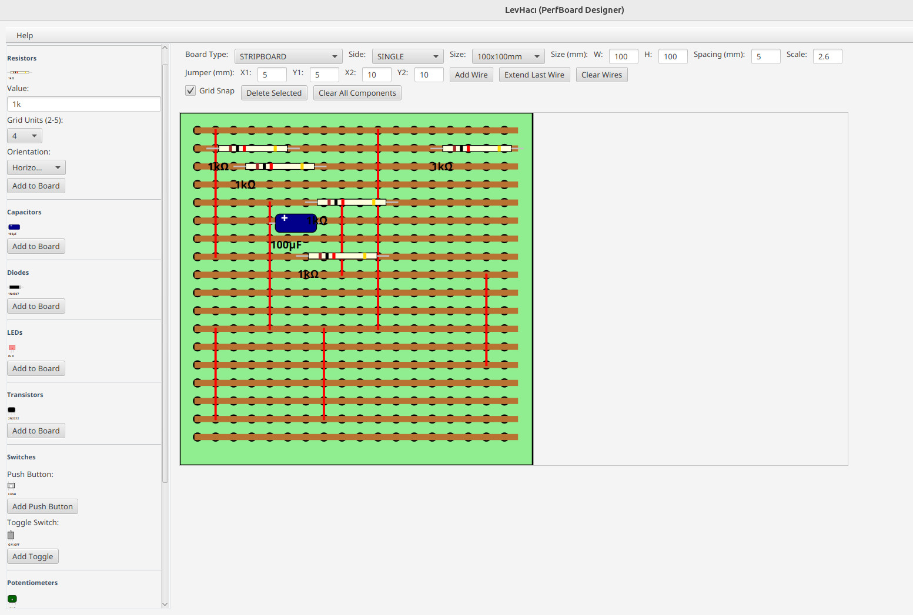
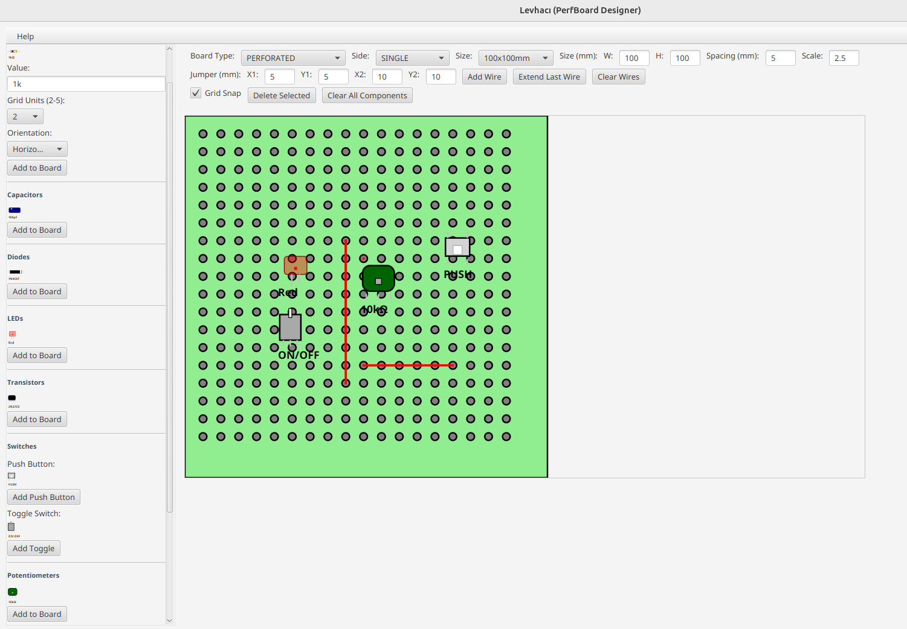
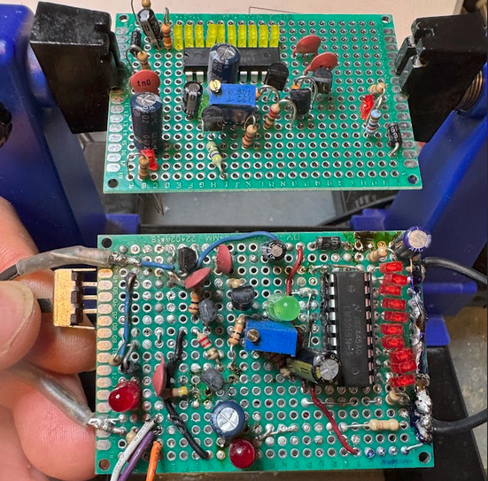

# LevHacı - PerfBoard Design Tool

> ⚠️ **Development Status**: This project is currently under active development and is not yet fully ready for production use. Features may be incomplete or subject to change.

LevHacı is a specialized perfboard (protoboard) design application developed for electronic circuit designers. Built with Java and JavaFX, it provides a modern interface for creating professional circuit layouts.

## Screenshot







*LevHacı interface showing perfboard design with various electronic components*

## What is LevHacı?

"LevHacı" is a Turkish word meaning "board maker". This application allows you to design electronic circuits on perfboards using various electronic components with precision and ease.

## Motivation

I started this project because working with perforated boards and stripboards without prior planning often leads to messy circuits with unnecessary wires, resulting in a cluttered and unprofessional final layout. To address this, I aimed to create an organized tool that allows visualizing and planning the design effectively. Having used Fritzing previously, I wanted to build something similar but tailored to perfboard-specific needs.



## Features

### Board Types
- **Perforated Board** - Standard dot matrix perfboards
- **Stripboard** - Pre-connected strip layouts
- **Mixed Board** - Combination of dots and strips
- **Single/Double Side** options

### Standard Sizes
- **160x100mm** - For larger projects
- **100x100mm** - Medium-scale circuits
- **Custom sizes** - Flexible dimensions
- **2.54mm grid** - Standard perfboard spacing

### Component Library

#### Passive Components
- **Resistors** - Adjustable 2-5 hole spacing
- **Capacitors** - Electrolytic and ceramic types
- **Potentiometers** - 3-pin adjustment elements

#### Active Components  
- **LEDs** - Various colors
- **Diodes** - Rectifier and Zener types
- **Transistors** - NPN/PNP varieties

#### Integrated Circuits
- **DIP4** - Optocoupler, Basic Logic
- **DIP8** - 555 Timer, Op-amp, EEPROM  
- **DIP14** - TTL Logic, Counters
- **DIP16** - Microcontroller, SRAM
- **DIP28** - ATmega328, EPROM
- **DIP40** - 8-bit CPU, Large MCU
- Complete range from DIP4 to DIP40

#### Switches
- **Push Buttons** - Momentary switches
- **Toggle Switches** - On/off controls

### Advanced Placement System
- **Grid Snap** - Automatic grid alignment
- **4-Way Orientation** - Horizontal, vertical, diagonal placement
- **Drag and Drop** - Easy component positioning
- **Real Scale** - 1:1 scale viewing

## Installation

### Requirements
- **Java 17** (OpenJDK recommended)
- **Maven** 
- **JavaFX SDK** (included via Maven dependencies)

### Setup Steps
1. Clone the repository:
   ```bash
   git clone https://github.com/faymaz/LevHaci.git
   cd LevHaci
   ```

2. Install dependencies:
   ```bash
   mvn install
   ```

3. Run the application:
   ```bash
   mvn javafx:run
   ```
4. Remove unnecessary mvn files:
   ```bash
   mvn clean
   ```

## Usage

### Basic Operations
1. **Board Settings**: Select board type and size from top panel
2. **Component Selection**: Choose components from left panel
3. **Placement**: Use "Add to Board" to place components
4. **Editing**: Drag components to reposition them
5. **Connections**: Use wire tools to create connections

### Advanced Features
- **Grid Units**: Adjust component sizes according to grid units
- **Orientation**: Place components in 4 different directions
- **Scale**: Adjust view scale from 50% to 200%
- **Selection**: Select and delete or edit components

## Development

This project is developed as open source. Contributions are welcome!

### Contributing
1. Fork the repository
2. Create a feature branch (`git checkout -b feature/new-feature`)
3. Commit your changes (`git commit -m 'Add new feature'`)
4. Push to the branch (`git push origin feature/new-feature`)
5. Create a Pull Request

## License

This project is released under the MIT License. See the [LICENSE](LICENSE) file for details.

## Links

- **GitHub**: [https://github.com/faymaz/LevHaci](https://github.com/faymaz/LevHaci)
- **Issues**: For bug reports and feature requests
- **Wiki**: Detailed documentation

## Developer

**faymaz** - *Project creator and lead developer*

---

*Design your electronic projects with LevHacı*